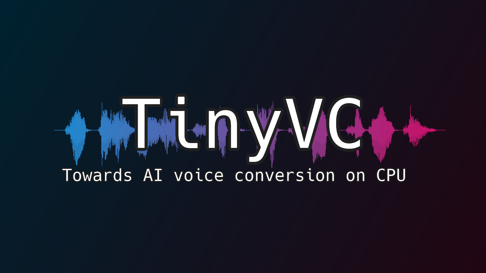
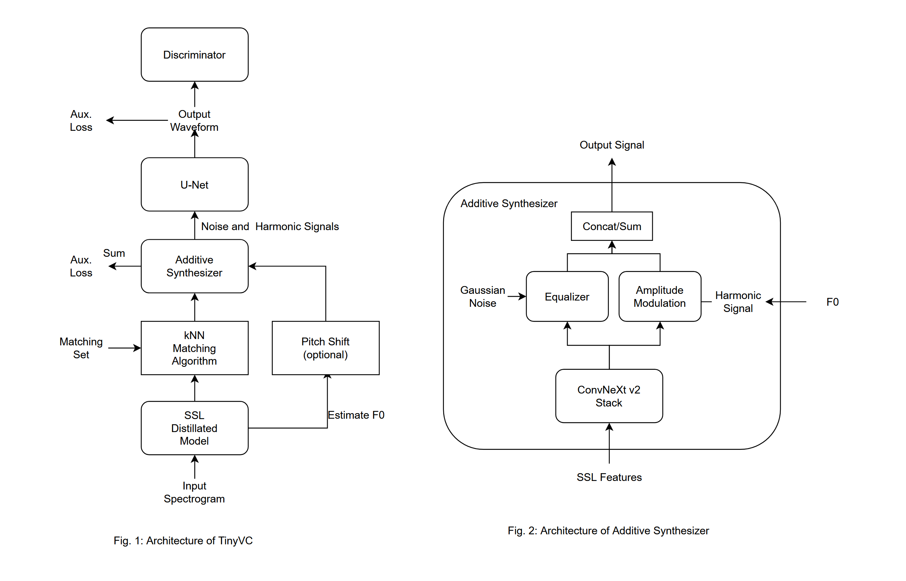

# TinyVC : Towards AI voice conversion on CPU

(This repository is experimental. Contents are subject to change without notice.)  
(This file was generated by machine translation. may contain mistakes.)

## Other languages
- [日本語](./documents/readme_ja.md)

## Download pretrained model
Pretrained models are available [here](https://huggingface.co/uthree/tinyvc/tree/main)!

## Model structure


## Features
- Real-time conversion
- Low latency (approximately 0.2 seconds, may vary depending on environment and optimization.)
- Phase and pitch are stable (based on source filter model)
- Speaker style conversion using k-nearest neighbor method
- Fully F0 controllable speech synthesis with additive synthesizer

## Things necessary
- Python 3.10 or later
- PyTorch 2.0 or later and GPU environment
- When training with full scratch, prepare a large amount of human voice data. (LJ Speech, JVS Corpus, etc.)

## install
1. Clone this repository
```sh
git clone https://github.com/uthree/tinyvc.git
````
2. Install dependencies
```sh
pip3 install -r requirements.txt
````

## Preliminary learning
Learn a model that performs basic speech conversion. At this stage, the model is not specialized for a specific speaker, but by preparing a model that can perform basic speech synthesis in advance, you can create a model that is specialized for a specific speaker with just a few adjustments. can be learned.

1. Pretreatment
Prepare a directory containing many audio files and run the following command
```sh
python3 preprocess.py <dataset directory>
````

2. Learn the encoder.
HuBERT, distilling pitch estimation.
```sh
python3 train_encoder.py
````

3. Learn decoder
The decoder's goal is to reconstruct the original waveform from the pitch and content.

```sh
python3 train_decoder.py
````

## Fine tuning
By adjusting the pre-trained model to a model specialized for conversion to a specific speaker, it is possible to create a more accurate model. This process takes much less time than pre-learning.
1. Combine only the audio files of a specific speaker into one folder and preprocess them.
```sh
python3 preprocess.py
````

2. Fine tune the decoder.
```sh
python3 train_decoder.py
````
3. Create a dictionary for vector search. This eliminates the need to encode audio files each time.
```sh
python3 extract_index.py -o <Dictionary output destination (optional)>
````
4. When inferring, you can load arbitrary dictionary data by adding the `-idx <dictionary file>` option.
The default dictionary file output destination is `models/index.pt`.

### Learning options
- Adding `-fp16 True` allows learning using 16-bit floating point numbers. Possible only for RTX series GPUs.
- Change batch size with `-b <number>`. Default is `16`.
- Change epoch number with `-e <number>`. Default is `60`.
- Change the computing device with `-d <device name>`. Default is `cuda`.

## Reasoning
1. Create an `inputs` folder.
2. Put the audio file you want to convert into the `inputs` folder
3. Run the inference script
```sh
python3 infer.py -t <target audio file>
````
Also, if you use a dictionary file,
```sh
python3 infer.py -idx <dictionary file>
````

### Additional options
- You can change the calculation device with `-d <device name>`. Although it may not make much sense since it is originally high speed.
- Pitch shift can be performed with `-p <scale>`. Useful for voice conversion between men and women. 12 raises it one octave.

## Real-time inference with pyaudio (feature in testing stage)
1. Check the ID of your audio device
```sh
python3 audio_device_list.py
````

2. Execution
```sh
python3 infer_streaming.py -i <input device ID> -o <output device ID> -l <loopback device ID> -t <target audio file>
````
(It works even without the loopback option.)

## References
- [FastSVC](https://arxiv.org/abs/2011.05731)
- [kNN-VC](https://arxiv.org/abs/2305.18975)
- [WavLM](https://arxiv.org/pdf/2110.13900.pdf) (Fig. 2)
- [StreamVC](https://arxiv.org/abs/2401.03078v1)
- [Hifi-GAN](https://arxiv.org/abs/2010.05646)
- [AdaIN](https://arxiv.org/abs/1703.06868)